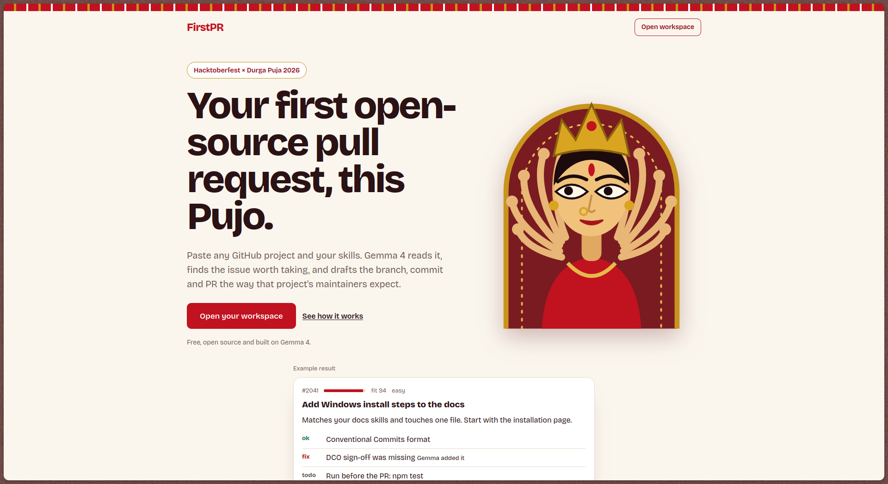
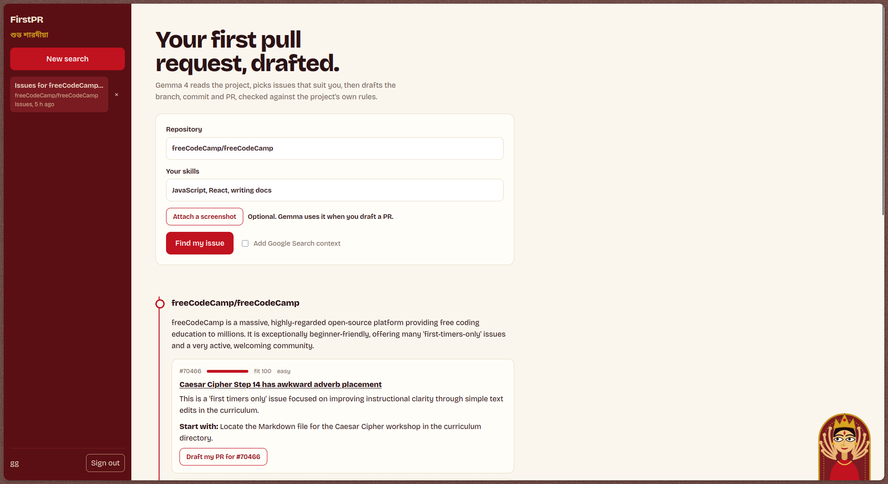
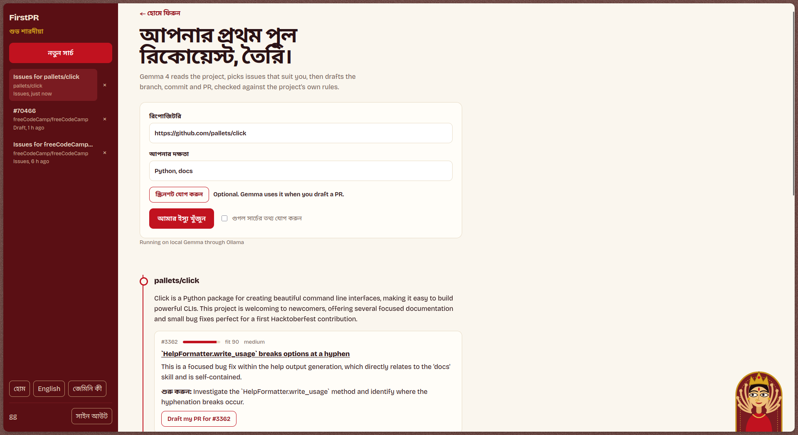

# FirstPR: a Hacktoberfest contribution copilot

Paste a GitHub repo and your skills. **FirstPR** (built on **Gemma 4**) reads the README, CONTRIBUTING file and open issues, ranks issues by fit, explains the code you need, then drafts a plan, branch name, commit message and PR description, and checks the draft against the project's own rules.

Ships three ways: a **web UI**, a **CLI**, and an **Agent Skill** (`skill/firstpr/SKILL.md`).

## Screenshots





## Quick start

```bash
pip install -r requirements.txt
export GEMINI_API_KEY=...        # https://aistudio.google.com/apikey
export GITHUB_TOKEN=...          # optional, avoids GitHub rate limits

python -m firstpr serve          # web UI at http://127.0.0.1:8000
python -m firstpr https://github.com/owner/repo --skills "python, docs" --ground
```

`FIRSTPR_MODEL` switches between `gemma-4-26b-a4b-it` (default) and `gemma-4-31b-it`.


## v2 features

- Accounts (scrypt-hashed passwords, httpOnly session cookie) and every search and draft saved per user in SQLite
- Mentor chat on each saved draft (Gemma answers follow-up questions with the draft as context)
- Optional screenshot attached when drafting (Gemma 4 multimodal input)
- "Claim the issue" comment, PR kit download as Markdown, responsive layout for phone, tablet and desktop
- A pumpkin whose eyes follow your pointer

Data lives in `firstpr.db` next to the project (ignored by git). Set `FIRSTPR_DB` to move it.


## Live progress and PR tracker

Steps stream to the page as Gemma works. Paste your PR link under a draft to track it (open, merged, closed) and see your progress in the sidebar.

## v3: built to win

- **Spam guard:** before you draft, FirstPR checks for a competing open PR, a claim in the comments, Hacktoberfest participation and any AI-contribution policy in README/CONTRIBUTING.
- **Git command kit:** fork, clone, branch, commit (with `-s` when DCO is required), push and the PR link, ready to paste.
- **Bengali mode:** the interface and Gemma's explanations switch to Bengali. Code, commits and PR text stay in English for maintainers. Voice input for skills uses the browser's speech recognition (`bn-IN` / `en-IN`).
- **Evaluation:** `python -m firstpr.evaluate` runs FirstPR on 10 real repos and writes `eval/results.json`. The landing page shows the measured numbers once that file exists.
- **Bring your own key:** with `FIRSTPR_REQUIRE_KEY=1` each visitor pastes their own Gemini key (kept in their browser, sent per request, never stored).

## Run Gemma locally (Ollama)

```bash
curl -fsSL https://ollama.com/install.sh | sh
ollama pull gemma4:e4b          # or gemma4:e2b (smaller), gemma4:12b, gemma4:26b
export FIRSTPR_LOCAL_MODEL=gemma4:e4b
python -m firstpr serve         # then tick "Run Gemma locally" under Gemini key
python -m firstpr owner/repo --local
```

Local mode uses the same tool-calling loop against Ollama's `/api/chat`, so the code, thinking and screenshot input all run on your machine. Google Search grounding is skipped offline. Set `OLLAMA_HOST` or `FIRSTPR_NUM_CTX` (default 16384) if needed.

## Deploy on Vercel (one project, no separate backend)

1. Push this repo to GitHub and import it in Vercel (zero config: `app.py` exposes the FastAPI app; Hobby functions can run up to 300 s).
2. In the Vercel project, open **Storage** and add a **Neon Postgres** database. It sets `DATABASE_URL` for you.
3. Add environment variables: `GITHUB_TOKEN`, `FIRSTPR_REQUIRE_KEY=1`, `FIRSTPR_SECURE=1`.
4. Deploy. Visitors paste their own free Gemini key, so your quota is never used. Local Ollama mode only works when you run FirstPR on your own computer.

## Deploy a live demo (Docker)

Hugging Face Spaces: create a Space with the **Docker** SDK, push this repo, then add `GITHUB_TOKEN` as a secret. Render and Fly work the same way using the `Dockerfile`. The container listens on `$PORT` (default 7860). History is stored in SQLite under `/tmp` and resets when the container restarts.

## How it uses Gemma 4

| Feature | Where |
|---|---|
| Long context | `core.analyze` sends README, CONTRIBUTING and 25 issues in one prompt |
| Function calling | `core._agent` lets Gemma call `get_issue`, `list_files`, `read_file` (`github.py`) |
| Thinking | `thinking_level="high"` on every call |
| Google Search grounding | `--ground` / UI checkbox, `core._ground` |
| Self-repair | failed rule checks are sent back to Gemma to fix, then rechecked |

Safeguards: the repo is pinned inside the tool executor, hallucinated issue numbers are dropped, and rule checks are deterministic code (`checks.py`), not model opinion.

## Agent Skill

Copy `skill/firstpr/` into any skills-compatible agent. It follows the Agent Skills standard (`SKILL.md` with `name` and `description`, plus `scripts/check_draft.py`).

## Responsible use

FirstPR drafts and explains. You write, test and submit the change yourself. Hacktoberfest discourages spam PRs, so read the issue, claim it, and keep changes small.

## License

MIT
